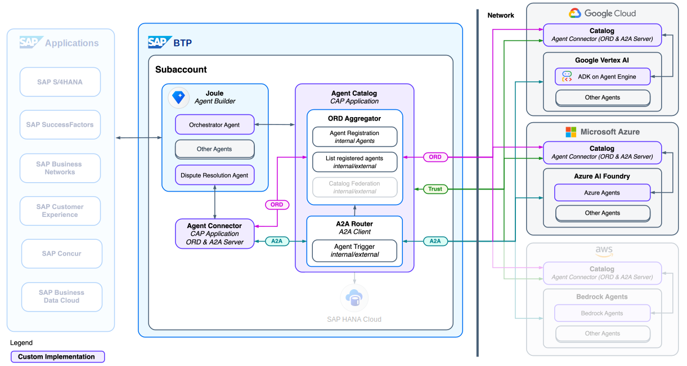

# Dispute Resolution with Multi-Agent Orchestration
[](https://api.reuse.software/info/github.com/SAP-samples/btp-a2a-dispute-resolution)

> [!NOTE]
> **Experimental**: The current source code and architecture are experimental, intended for research and proof-of-concept purposes, and are subject to change.

This repository demonstrates an end-to-end scenario where multiple organizations collaborate through domain-specific AI agents to resolve a customer dispute.
The agents use an open [Agent-to-Agent (A2A)](https://github.com/google/A2A) communication protocol and [Open Resource Discovery (ORD)](https://github.com/open-resource-discovery/specification) to dynamically discover each other's capabilities and collaborate on complex tasks that exceed the scope of a single agent.

## Scenario

XStore disputes an invoice from Cymbal Direct after receiving a short shipment of 900 t-shirts instead of the expected 1,000. Vicky, an employee of Cymbal Direct, uses **Joule** to resolve the issue with the help of several backend agents representing different organizations and capabilities.

### Scenario Breakdown

- **User Prompt**: Vicky reports a shipment discrepancy via Joule.
- **Joule as Orchestrator Agent Planning**:
  - Identifies required agents from the Agent Catalog.
  - Creates a task plan for orchestration.
- **Agent Orchestration**:
  - **Dispute Resolution Agent (SAP)**: Confirms invoice and shipment data from SAP S/4HANA; expected 1,000 units.
  - **Warehouse Insights Agent (Google)**: Analyzes logistics and retrieves a packaging slip showing only 900 t-shirts shipped.
  - **Dispute Policy & Email Agent (Microsoft)**: Retrieves communication logs and creates an email draft to the customer according to the dispute policy.
- **Response to User**:
  - Confirmation of dispute resolution creation and customer email.

## Architecture


> [!NOTE]
> This architecture illustrates AI agents integrated via point-to-point connections, as currently implemented. Alternatively, a centralized orchestrator per platform could be introduced.

## Repository Structure
### [agent-catalog](/agent-catalog/): Agent discovery and routing services 
  - `ord-aggregator`: Acts as `AGENT_CATALOG`, aggregates Agent Cards across catalogs (SAP, GCP, Azure) using ORD.
  - `a2a-router`: Acts as `AGENT_ROUTER` which connects to `ord-aggregator` and routes requests to appropriate agents using A2A protocol (A2A Client)

### [agents](/agents/): A2A agents on SAP, GCP and Azure
  - [sap-agent-builder-a2a](/agents/sap-agent-builder-a2a/)
      - agent-builder-a2a-agent-conntector: CAP application that wraps an Agent running on Agent Builder (SAP BTP) to enable A2A and exposing its Agent Card via Open Resource Discovery (ORD). 
      - agent-builder-agent-exports: Exported agents from BAF
          - `orchestrator`: Joule's main entry point for the scenario
          - `dispute-resolution-agent`: Agent running on Agent Builder (SAP BTP) that handles dispute resolution.
  - [gcp-adk-a2a](/agents/gcp-adk-a2a/): Agent deployed on GCP based on A2A and exposed Agent Card via Open Resource Discovery (ORD).
      - `warehouse-insights-agent`: Tracks stock movements across the warehouse and their causes in real-time.
  - [azure-ai-foundry-a2a](/agents/azure-ai-foundry-a2a/): Agent deployed on Azure based on A2A and exposed Agent Card via Open Resource Discovery (ORD).
      - `dispute-email-agent`: Agent that creates email drafts according to specific dispute policies for dispute resolution.

## Prerequisites

To run this project, ensure you have access to the following components:

- SAP BTP Subaccount
- Cloud Foundry Runtime enabled
- Business Agent Foundation (BAF) / Project Agent Builder subscription
- One or more A2A-enabled agent runtimes:
  - Google Vertex AI Agent or Google Cloud Run
  - Azure AI Foundry Agent or Azure Web Apps


## Provisioning of Agents with A2A

### SAP Business Agent Foundation (BAF)

1. Create the SAP Dispute Resolution Agent using the following JSON specification as a reference. Note: Importing this JSON directly to BAF is not supported at the moment. Instead, use the JSON to manually create the agent via the BAF UI.  
   [Dispute Resolution Agent JSON](https://github.com/SAP-samples/btp-a2a-dispute-resolution/blob/main/agents/sap-agent-builder-a2a/agent-builder-agent-exports/dispute-resolution-agent.json)

2. Retrieve the Agent ID from BAF and add it to the `.cdsrc.json` of the Agent Connector  
   [Example `.cdsrc.json`](https://github.com/SAP-samples/btp-a2a-dispute-resolution/blob/main/agents/sap-agent-builder-a2a/agent-builder-a2a-agent-connector/.cdsrc.json)

3. Deploy the Agent Connector as an MTA to your SAP BTP Subaccount (Cloud Foundry Runtime):  
   ```bash
   npm run build-d
   ```
   Run this command in the connector folder: [Agent Connector Folder](https://github.com/SAP-samples/btp-a2a-dispute-resolution/tree/main/agents/sap-agent-builder-a2a/agent-builder-a2a-agent-connector)

### Google Cloud (optional alternative)

Create a Vertex AI Agent with A2A support:

1. Deploy the `Warehouse Insight Agent` to Google Cloud Run. Follow the instructions provided in the deployment guide: [Google Cloud Agent Folder](https://github.com/SAP-samples/btp-a2a-dispute-resolution/tree/main/agents/gcp-adk-a2a#adk-agent-a2a-server-deployment-steps)

### Microsoft Azure (optional alternative)

Create an AI Foundry Agent with A2A support

1. Deploy the `Dispute Email Agent` to Azure Web Apps. Follow the instructions provided in the deployment guide: [Azure Agent Folder](https://github.com/SAP-samples/btp-a2a-dispute-resolution/tree/main/agents/azure-ai-foundry-a2a#azure-agent-a2a-server-deployment-steps)


## Deployment of Catalog (includes Agent Router as A2A Client)

1. Duplicate the `.cdsrc-sample.json` as `.cdsrc.json`: [Sample Config](https://github.com/SAP-samples/btp-a2a-dispute-resolution/blob/main/agent-catalog/.cdsrc-sample.json)

2. Add the hosts of the three agents (BAF, GCP, Azure) to the config.

3. Deploy the Agent Catalog as an MTA to your SAP BTP Subaccount (Cloud Foundry Runtime):
   ```bash
   npm run deploy
   ```
   Execute this command in the catalog folder: [Agent Catalog Folder](https://github.com/SAP-samples/btp-a2a-dispute-resolution/tree/main/agent-catalog)


## Create the Orchestrator as entry point for the scenario:
- Define Destinations on the SAP BTP Subaccount in which BAF/Project Agent Builder is subscribed:
    - AGENT_CATALOG: Point to the ORD-Aggregator endpoint of your deployed Agent Catalog: `https://<YOUR_URL>.hana.ondemand.com/ord-aggregator`
    - AGENT_ROUTER: Point to the Agent Router endpoint of your deployed Agent Catalog: `https://<YOUR_URL>.hana.ondemand.com/a2a-router`
   <p float="left">
        
   </p>
- Create Orchestrator Agent in BAF: https://github.com/SAP-samples/btp-a2a-dispute-resolution/blob/main/agents/sap-agent-builder-a2a/agent-builder-agent-exports/orchestrator.json
    <p float="left">
        
    </p>

- Create `Bring-Your-Own-Tool` Tools for the Orchestrator Agent pointing to the Destinations AGENT_CATALOG and AGENT_ROUTER 
    <p float="left">
      
      
    </p>


>HINT: For debugging and development locally, open a tunnel (e.g., via ngrok) to your machine and point to your local CAP server (port 4005 here) by entering `<YOUR_TUNNEL>:4005/ord-aggregator` and `<YOUR_TUNNEL>:4005/a2a-router` as the destinations URLs. With this setup, the Orchestrator Agent connects to the Agent Catalog running on your machine.

## Develop/Run locally (Agent Catalog):
1. Ensure your machine supports TypeScript:
   ```bash
   npm i -g typescript ts-node tsx
   ```
   [Enable TypeScript Support](https://cap.cloud.sap/docs/node.js/typescript#enable-typescript-support)

2. Ensure the `.cdsrc.json` contains correct host URLs (Deployment of Catalog (includes Agent Router as A2A Client))
3. Ensure BTP Destinations point to your machine (see tunneling note).
4. In the `agent-catalog` folder run [Agent Catalog Folder](https://github.com/SAP-samples/btp-a2a-dispute-resolution/tree/main/agent-catalog):
   ```bash
   npm install
   npm run watch
   ```
5. Trigger interactions via the Orchestrator Agent.


## Known Issues
No known issues.

## How to obtain support
[Create an issue](https://github.com/SAP-samples/<repository-name>/issues) in this repository if you find a bug or have questions about the content.
 
For additional support, [ask a question in SAP Community](https://answers.sap.com/questions/ask.html).

## Contributing
If you wish to contribute code, offer fixes or improvements, please send a pull request. Due to legal reasons, contributors will be asked to accept a DCO when they create the first pull request to this project. This happens in an automated fashion during the submission process. SAP uses [the standard DCO text of the Linux Foundation](https://developercertificate.org/).

## License
Copyright (c) 2024 SAP SE or an SAP affiliate company. All rights reserved. This project is licensed under the Apache Software License, version 2.0 except as noted otherwise in the [LICENSE](LICENSE) file.
