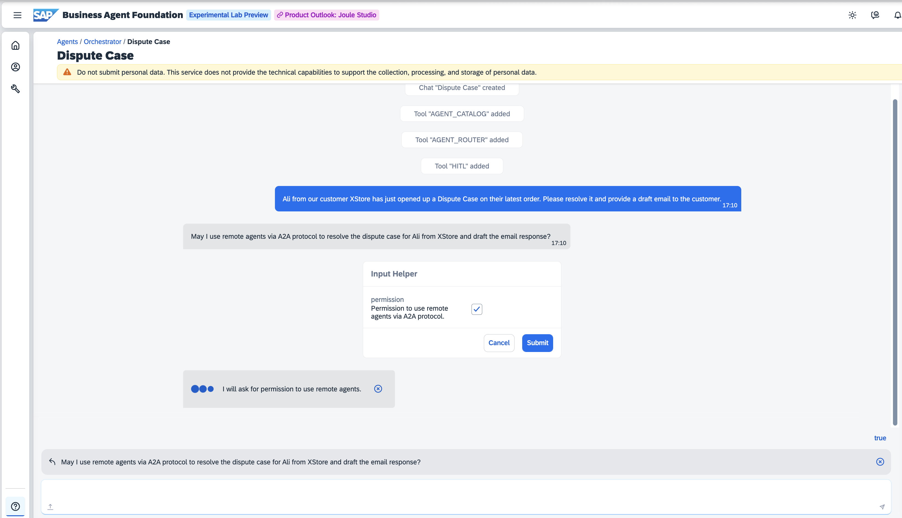
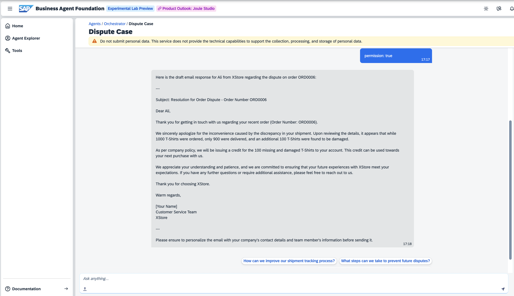
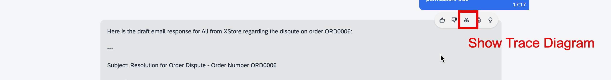
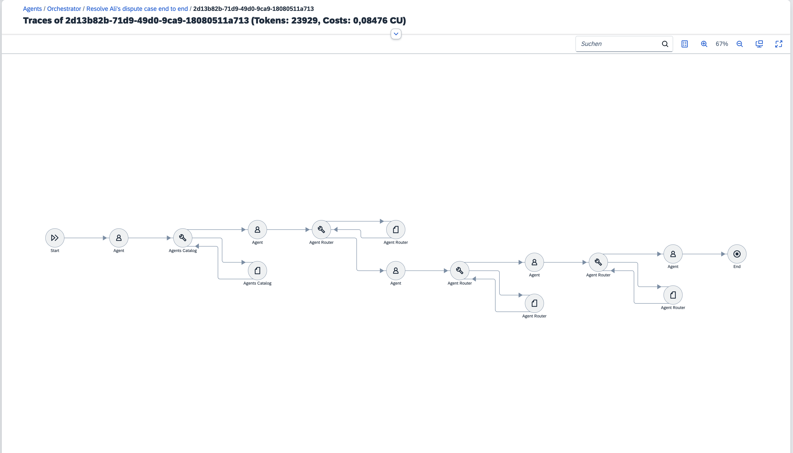
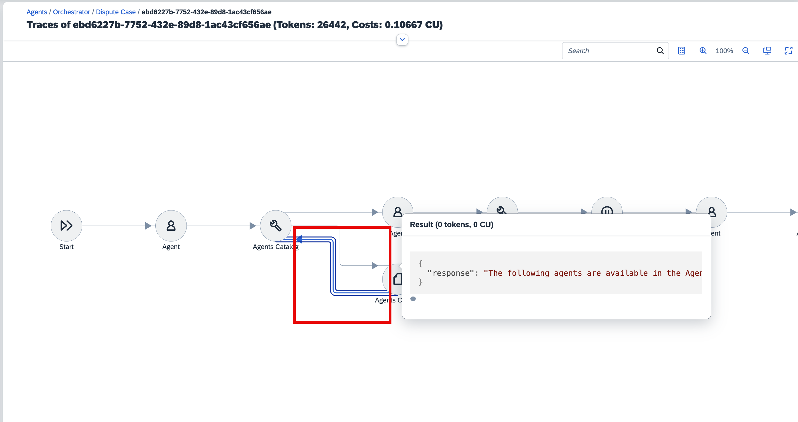
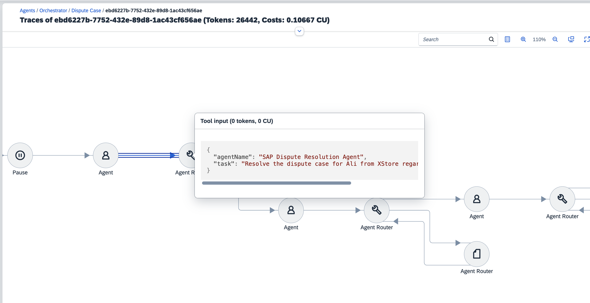
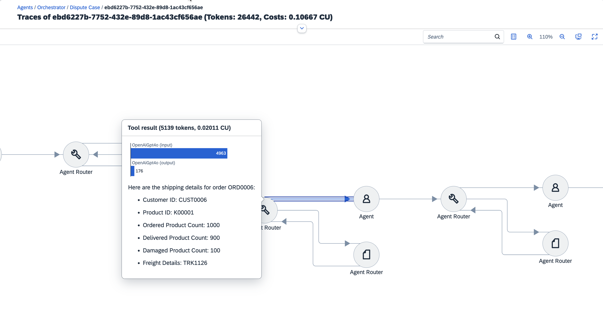
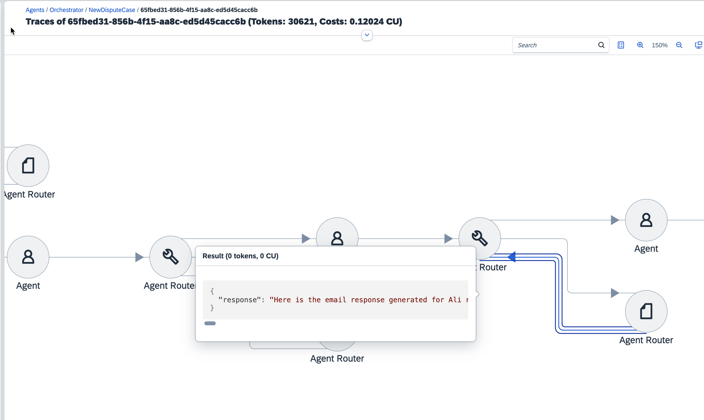

## Provision A2A Agents

### SAP Business Agent Foundation (BAF)

1. Create the SAP Dispute Resolution Agent using the following JSON specification as a reference. Note: Importing this JSON directly to BAF is not supported at the moment. Instead, use the JSON to manually create the agent via the BAF UI.  
   [Dispute Resolution Agent JSON](https://github.com/SAP-samples/btp-a2a-dispute-resolution/blob/main/agents/sap-agent-builder-a2a/agent-builder-agent-exports/dispute-resolution-agent.json)

2. Duplicate the `.cdsrc-sample.json` as `.cdsrc.json`: [Sample Config](https://github.com/SAP-samples/btp-a2a-dispute-resolution/blob/main/agents/sap-agent-builder-a2a/agent-builder-a2a-agent-connector/.cdsrc-sample.json)
3. Retrieve the Agent ID from BAF and add it to the created `.cdsrc.json` of the Agent Connector.

    <p float="left">
        
   </p>

4. Deploy the Agent Connector as an MTA to your SAP BTP Subaccount (Cloud Foundry Runtime):  
   ```bash
   npm install
   npm run deploy
   ```
   Run this command in the connector folder: [Agent Connector Folder](https://github.com/SAP-samples/btp-a2a-dispute-resolution/tree/main/agents/sap-agent-builder-a2a/agent-builder-a2a-agent-connector)

>Note: Make sure `cds` is installed before deployment: ```npm i -g @sap/cds-dk```

### Google Cloud 

Deploy the `Warehouse Insight Agent` to Google Cloud Run. Follow the instructions provided in the deployment guide: [Google Cloud Agent Folder](https://github.com/SAP-samples/btp-a2a-dispute-resolution/tree/main/agents/gcp-adk-a2a#adk-agent-a2a-server-deployment-steps)

>Note: Optionally build using the Vertex AI Agent Development Kit (ADK) with A2A support, covering the same functionality

### Microsoft Azure 

Deploy the `Dispute Email Agent` to Azure Web Apps. Follow the instructions provided in the deployment guide: [Azure Agent Folder](https://github.com/SAP-samples/btp-a2a-dispute-resolution/tree/main/agents/azure-ai-foundry-a2a#azure-agent-a2a-server-deployment-steps)

>Note: Optionally build using Azure AI Foundry, covering the same functionality

## Deploy the Agent Catalog

This includes Agent Router as A2A Client

1. Duplicate the `.cdsrc-sample.json` as `.cdsrc.json`: [Sample Config](https://github.com/SAP-samples/btp-a2a-dispute-resolution/blob/main/agent-catalog/.cdsrc-sample.json)

2. Add the base URLs (hosts) including protocol (e.g., `https://`) of the three agent hosts (BAF, GCP, Azure) to the config — these URLs are used to locate the `.well-known` endpoint from which the ORD document is retrieved.

3. Deploy the Agent Catalog as an MTA to your SAP BTP Subaccount (Cloud Foundry Runtime):
   ```bash
   npm install
   npm run deploy
   ```
   Execute this command in the catalog folder: [Agent Catalog Folder](https://github.com/SAP-samples/btp-a2a-dispute-resolution/tree/main/agent-catalog)

>Note: Make sure `cds` is installed before deployment: ```npm i -g @sap/cds-dk```

## Set up the Orchestrator as Scenario Entry Point
- Define Destinations on the SAP BTP Subaccount in which BAF/Project Agent Builder is subscribed:
    - AGENT_CATALOG: Point to the ORD-Aggregator endpoint of your deployed Agent Catalog: `https://<YOUR_URL>.hana.ondemand.com/ord-aggregator`
    - AGENT_ROUTER: Point to the Agent Router endpoint of your deployed Agent Catalog: `https://<YOUR_URL>.hana.ondemand.com/a2a-router`
   <p float="left">
        
   </p>
- Create Orchestrator Agent in BAF: https://github.com/SAP-samples/btp-a2a-dispute-resolution/blob/main/agents/sap-agent-builder-a2a/agent-builder-agent-exports/orchestrator.json
    <p float="left">
        
    </p>

- Create `Bring-Your-Own-Tool` Tools for the Orchestrator Agent pointing to the Destinations AGENT_CATALOG and AGENT_ROUTER 
    <p float="left">
      
      
    </p>


>HINT: For debugging and development locally, open a tunnel (e.g., via ngrok) to your machine and point to your local CAP server (port 4005 here) by entering `<YOUR_TUNNEL>:4005/ord-aggregator` and `<YOUR_TUNNEL>:4005/a2a-router` as the destinations URLs. With this setup, the Orchestrator Agent connects to the Agent Catalog running on your machine.

## Develop & Run locally

### Agent Catalog:
1. Ensure your machine supports TypeScript:
   ```bash
   npm i -g typescript ts-node tsx
   ```
   [Enable TypeScript Support](https://cap.cloud.sap/docs/node.js/typescript#enable-typescript-support)

2. Ensure the `.cdsrc.json` contains correct host URLs (Deployment of Catalog (includes Agent Router as A2A Client))
3. Ensure BTP Destinations point to your machine. Open a tunnel (e.g., via ngrok) to your machine and point to your local CAP server (port 4005 here) by entering `<YOUR_TUNNEL>:4005/a2a-router` 
4. In the `agent-catalog` [Folder](https://github.com/SAP-samples/btp-a2a-dispute-resolution/tree/main/agent-catalog) run:
   ```bash
   npm install
   npm run watch
   ```
5. Trigger interactions via the Orchestrator Agent.


### Agent Connector:
1. Ensure your machine supports TypeScript:
   ```bash
   npm i -g typescript ts-node tsx
   ```
   [Enable TypeScript Support](https://cap.cloud.sap/docs/node.js/typescript#enable-typescript-support)
2. Duplicate the `.cdsrc-private-sample.json` as `.cdsrc-private.json`: [Sample Config](https://github.com/SAP-samples/btp-a2a-dispute-resolution/blob/main/agent-catalog/.cdsrc-private-sample.json)
3. Enter the values for the created `.cdsrc-private.json` and make sure it contains the correct credentials from the `BAF service instance` and Agent ID:
    ```json
    {
       "requires": {
          "baf": {
             "kind": "baf",
             "credentials": {
                "service_urls": {
                   "agent_api_url": ""
                },
                "uaa": {
                    "clientid": "",
                    "clientsecret": "",
                    "tokenUrl": "",
                    "apiUrl": ""
                },
                "agentId": ""
             }
          }
       }
    }
   ```
5. Make sure the Host of the Agent Connector in the Agent Catalog is set to your local machine. Open a tunnel (e.g., via ngrok) to your machine and point to your local CAP server (port 4005 here) by entering `<YOUR_TUNNEL>:4005/a2a-service`
6. In the `agent-connector` [Folder](https://github.com/SAP-samples/btp-a2a-dispute-resolution/tree/main/agents/sap-agent-builder-a2a/agent-builder-a2a-agent-connector) run:
   ```bash
   npm install
   npm run watch
   ```
7. Trigger interactions via the Orchestrator Agent.


## Test It Yourself

Start a new chat for the Orchestrator Agent and ask:

```
Ali from our customer XStore has just opened up a Dispute Case on their latest order. 
Please resolve it and provide a draft email to the customer.
```
<p float="left">
   
</p>

Provide confirmation to use a remote agetns via A2A protocol. Confirm with "Yes" to proceed. 

The Orchestrator Agent will identify the required agents from the Agent Catalog, create a task plan for orchestration, and initiate the dispute resolution process. 

As an outcome, you will receive a confirmation of the dispute resolution creation and a draft email to the customer.

<p float="left">
   
</p>

### Understand what happenes behind the scenes
If you open the 'Trace Diagram' (highlited in the screeshot below) you can see the flow of the agents and their interactions.

<p float="left"></p>
<p float="left"></p>

Before the orchecstration agent start distributing tasks to the agents, it first checks the Agent Catalog for available agents. 
>Note: in the flow diagram if you click on the arrow between the Orchestrator Agent and the Agent Catalog, you can see the response of the Agent Catalog.

<p float="left">
   
</p>

Agent catalog will return list of following agents:
- SAP Dispute Resolution Agent running on Agent Builder 
- Warehouse Insights Agent running on Google Cloud, built with Agent Development Kit (ADK)
- Azure Dispute Policy and Email Agent running on Azure 

<details>
<summary>Agent Catalog response</summary>
<pre><code>
{
  "catalog": [
    {
      "ordVersion": "1.9",
      "ordDocUrl": "https://platform-adoption-advisory-sce-testpab-56g0kzwc-dev-baf2d5a016e.cfapps.eu12.hana.ondemand.com/open-resource-discovery/v1/documents/1",
      "provider": "SAP",
      "agentCardUrl": "https://platform-adoption-advisory-sce-testpab-56g0kzwc-dev-baf2d5a016e.cfapps.eu12.hana.ondemand.com/.well-known/agent.json",
      "agent": {
        "name": "SAP Dispute Resolution Agent",
        "description": "Resolve disputes, manage business processes, and analyze data in the cloud",
        "url": "https://platform-adoption-advisory-sce-testpab-56g0kzwc-dev-baf2d5a016e.cfapps.eu12.hana.ondemand.com/a2a-service",
        "version": "0.0.1",
        "defaultInputModes": ["text/plain"],
        "defaultOutputModes": ["text/plain", "application/html"],
        "capabilities": {
          "streaming": false,
          "callback": true
        },
        "skills": [
          {
            "id": "dispute-management",
            "name": "Dispute Management",
            "description": "Manage and resolve business disputes efficiently",
            "tags": ["dispute", "management", "resolution"],
            "examples": [
              "list all open dispute cases",
              "resolve dispute case #12345",
              "provide details of dispute case #67890"
            ],
            "outputModes": ["text/plain", "application/html"]
          },
          {
            "id": "business-data-cloud-analysis",
            "name": "Business Data Cloud Analysis",
            "description": "Analyze business data using cloud-based tools",
            "tags": ["data analysis", "business", "cloud"],
            "examples": [
              "analyze financial data for the past quarter",
              "generate a report on sales performance metrics",
              "compare customer engagement data across regions"
            ],
            "outputModes": ["application/html", "text/csv"]
          }
        ]
      }
    },
    {
      "ordVersion": "1.9",
      "ordDocUrl": "https://adk-agent-service-direct-395311854449.us-central1.run.app//open-resource-discovery/v1/documents/1",
      "provider": "Google",
      "agentCardUrl": "https://adk-agent-service-direct-395311854449.us-central1.run.app//.well-known/agent.json",
      "agent": {
        "capabilities": {
          "pushNotifications": false,
          "streaming": false
        },
        "defaultInputModes": ["text/plain"],
        "defaultOutputModes": ["text/plain"],
        "description": "Tracks stock movements across the warehouse and their causes in real-time.",
        "name": "Warehouse_Insight_Agent",
        "skills": [
          {
            "description": "Tracks stock movements across the warehouse and their causes in real-time.",
            "examples": [
              "why did the stock level for Item X drop this morning?",
              "which orders caused stock changes for Item Y in the last 24 hours?"
            ],
            "id": "warehouse-insight-query",
            "name": "Warehouse Insight Query Tool",
            "tags": ["warehouse", "stock", "inventory", "data query", "shipping"]
          }
        ],
        "url": "https://adk-agent-service-direct-395311854449.us-central1.run.app/",
        "version": "0.0.1"
      }
    },
    {
      "ordVersion": "1.9",
      "ordDocUrl": "https://a2aazureserver2-ddatapg8auhzbccf.eastus2-01.azurewebsites.net/open-resource-discovery/v1/documents/1",
      "provider": "Microsoft",
      "agentCardUrl": "https://a2aazureserver2-ddatapg8auhzbccf.eastus2-01.azurewebsites.net/.well-known/agent.json",
      "agent": {
        "capabilities": {
          "pushNotifications": false,
          "streaming": false
        },
        "defaultInputModes": ["text/plain"],
        "defaultOutputModes": ["text/plain"],
        "description": "Analyzes dispute and using provided additional information, drafts a response email.",
        "name": "Dispute_Email_Agent",
        "skills": [
          {
            "description": "Generates an email response for a given dispute shared by a customer.",
            "examples": [
              "Generate a response for dispute by Customer CUST001, order ORD0001, where only 90 of the ordered 100 items were delivered."
            ],
            "id": "dispute_email_generation",
            "name": "Dispute Email Generation Tool",
            "tags": ["dispute resolution", "customer service", "dispute email", "email generation"]
          }
        ],
        "url": "https://a2aazureserver2-ddatapg8auhzbccf.eastus2-01.azurewebsites.net/",
        "version": "0.0.1"
      }
    }
  ]
}
</code></pre>

</details>
<br>

Orchestrator Agent will perform following steps:

1. first call the dispote resolution agent to confirm the invoice and shipment data from SAP S/4HANA and confirm the expected 1,000 units shipped
   <p float="left">
      
   </p>

2. Call the warehouse insights agent to analyze logistics and retrieve a packaging slip showing only 900 t-shirts shipped
   <p float="left">
      
   </p>

3. Call the dispute policy and email agent to retrieve communication history and create an email draft to the customer according to the dispute policy
   <p float="left">
      
   </p>
