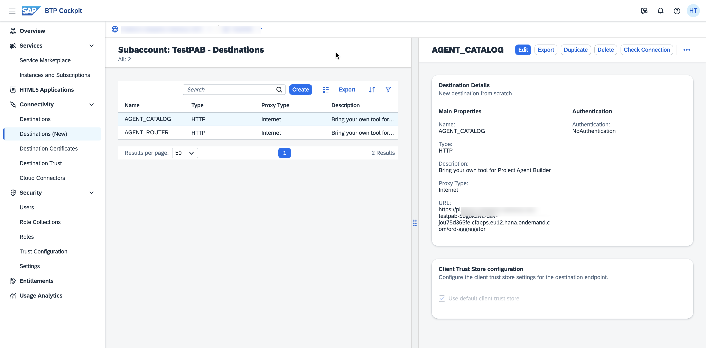
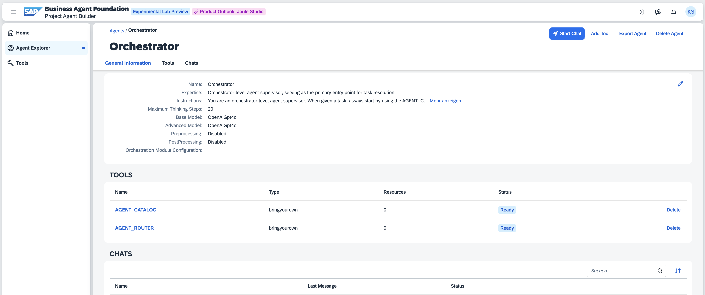
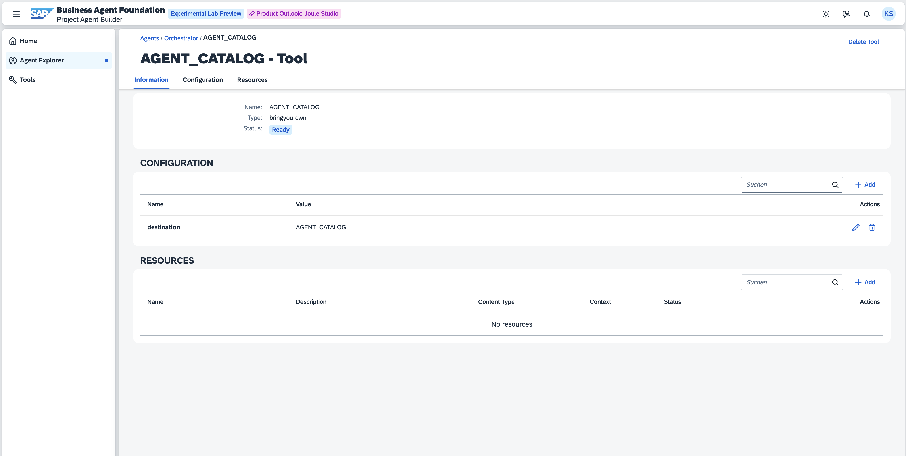

## Provisioning of A2A Agents

### SAP Business Agent Foundation (BAF)

1. Create the SAP Dispute Resolution Agent using the following JSON specification as a reference. Note: Importing this JSON directly to BAF is not supported at the moment. Instead, use the JSON to manually create the agent via the BAF UI.  
   [Dispute Resolution Agent JSON](https://github.com/SAP-samples/btp-a2a-dispute-resolution/blob/main/agents/sap-agent-builder-a2a/agent-builder-agent-exports/dispute-resolution-agent.json)

2. Retrieve the Agent ID from BAF and add it to the `.cdsrc.json` of the Agent Connector  
   [`.cdsrc.json`](https://github.com/SAP-samples/btp-a2a-dispute-resolution/blob/main/agents/sap-agent-builder-a2a/agent-builder-a2a-agent-connector/.cdsrc.json)

    <p float="left">
        
   </p>

3. Deploy the Agent Connector as an MTA to your SAP BTP Subaccount (Cloud Foundry Runtime):  
   ```bash
   npm run build-d
   ```
   Run this command in the connector folder: [Agent Connector Folder](https://github.com/SAP-samples/btp-a2a-dispute-resolution/tree/main/agents/sap-agent-builder-a2a/agent-builder-a2a-agent-connector)

### Google Cloud 

Deploy the `Warehouse Insight Agent` to Google Cloud Run. Follow the instructions provided in the deployment guide: [Google Cloud Agent Folder](https://github.com/SAP-samples/btp-a2a-dispute-resolution/tree/main/agents/gcp-adk-a2a#adk-agent-a2a-server-deployment-steps)

>Note: optionaly build with Vertex AI Agent Development Kit (ADK) with A2A suppoert covering same functionality

### Microsoft Azure 

Deploy the `Dispute Email Agent` to Azure Web Apps. Follow the instructions provided in the deployment guide: [Azure Agent Folder](https://github.com/SAP-samples/btp-a2a-dispute-resolution/tree/main/agents/azure-ai-foundry-a2a#azure-agent-a2a-server-deployment-steps)

>Note: optionaly build with AI Foundry ...

## Deployment of Agent Catalog

This includes Agent Router as A2A Client

1. Duplicate the `.cdsrc-sample.json` as `.cdsrc.json`: [Sample Config](https://github.com/SAP-samples/btp-a2a-dispute-resolution/blob/main/agent-catalog/.cdsrc-sample.json)

2. Add the hosts of the three agents (BAF, GCP, Azure) to the config.

3. Deploy the Agent Catalog as an MTA to your SAP BTP Subaccount (Cloud Foundry Runtime):
   ```bash
   npm run deploy
   ```
   Execute this command in the catalog folder: [Agent Catalog Folder](https://github.com/SAP-samples/btp-a2a-dispute-resolution/tree/main/agent-catalog)


## Create the Orchestrator as entry point for the scenario
- Define Destinations on the SAP BTP Subaccount in which BAF/Project Agent Builder is subscribed:
    - AGENT_CATALOG: Point to the ORD-Aggregator endpoint of your deployed Agent Catalog: `https://<YOUR_URL>.hana.ondemand.com/ord-aggregator`
    - AGENT_ROUTER: Point to the Agent Router endpoint of your deployed Agent Catalog: `https://<YOUR_URL>.hana.ondemand.com/a2a-router`
   <p float="left">
        
   </p>
- Create Orchestrator Agent in BAF: https://github.com/SAP-samples/btp-a2a-dispute-resolution/blob/main/agents/sap-agent-builder-a2a/agent-builder-agent-exports/orchestrator.json
    <p float="left">
        
    </p>

- Create `Bring-Your-Own-Tool` Tools for the Orchestrator Agent pointing to the Destinations AGENT_CATALOG and AGENT_ROUTER 
    <p float="left">
      
      
    </p>


>HINT: For debugging and development locally, open a tunnel (e.g., via ngrok) to your machine and point to your local CAP server (port 4005 here) by entering `<YOUR_TUNNEL>:4005/ord-aggregator` and `<YOUR_TUNNEL>:4005/a2a-router` as the destinations URLs. With this setup, the Orchestrator Agent connects to the Agent Catalog running on your machine.

## Develop/Run locally 

### Agent Catalog:
1. Ensure your machine supports TypeScript:
   ```bash
   npm i -g typescript ts-node tsx
   ```
   [Enable TypeScript Support](https://cap.cloud.sap/docs/node.js/typescript#enable-typescript-support)

2. Ensure the `.cdsrc.json` contains correct host URLs (Deployment of Catalog (includes Agent Router as A2A Client))
3. Ensure BTP Destinations point to your machine (see tunneling note).
4. In the `agent-catalog` [Folder](https://github.com/SAP-samples/btp-a2a-dispute-resolution/tree/main/agent-catalog) run:
   ```bash
   npm install
   npm run watch
   ```
5. Trigger interactions via the Orchestrator Agent.


### Agent Connector:
1. Ensure your machine supports TypeScript:
   ```bash
   npm i -g typescript ts-node tsx
   ```
   [Enable TypeScript Support](https://cap.cloud.sap/docs/node.js/typescript#enable-typescript-support)
2. Ensure the `.cdsrc.json` contains correct Agent ID
3. Make sure the Host of the Agent Connector in the Agent Catalog is set to your local machine (tunnel)
4. In the `agent-connector` [Folder](https://github.com/SAP-samples/btp-a2a-dispute-resolution/tree/main/agents/sap-agent-builder-a2a/agent-builder-a2a-agent-connector) run:
   ```bash
   npm install
   npm run watch
   ```
5. Trigger interactions via the Orchestrator Agent.


## Try It Out

Start a new chat for the Orchestrator Agent and ask:

```
Ali from our customer XStore has just opened up a Dispute Case on their latest order. Start to resolve it.
```
